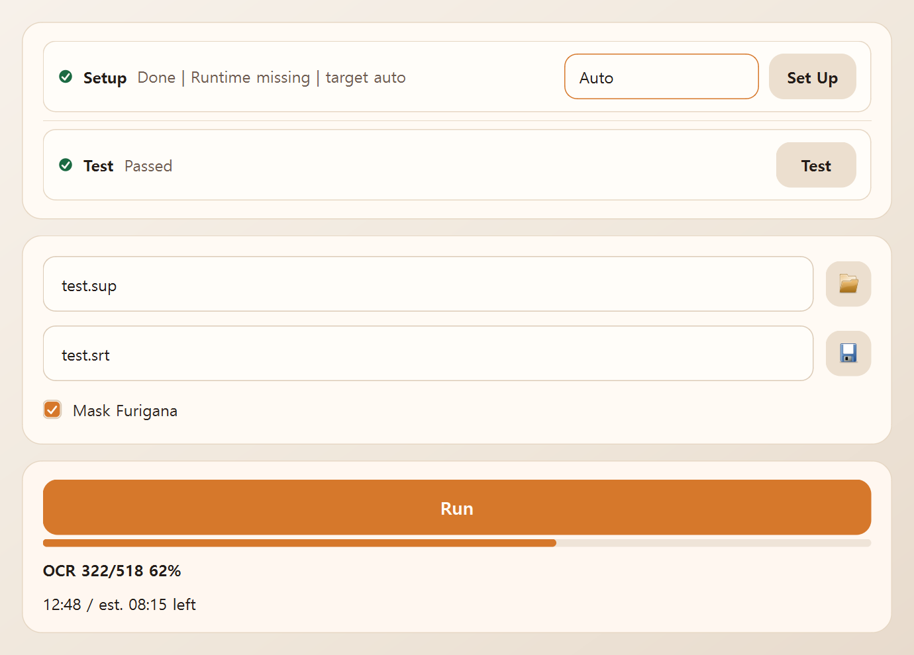

# IStoTS: Image Subtitles to Text Subtitles

`istots` converts Blu-ray `SUP` subtitles into `SRT` subtitles with
PaddleOCR-VL 1.5. Many older subtitle OCR tools are built around Tesseract or
similar OCR engines. Those tools are mature, fully offline, and often fast,
especially on clean English subtitles. `istots` instead uses a
vision-language-model OCR stack chosen for strong `SUP` handling. It is
slower, but it is usually more accurate on multilingual subtitles, especially
on CJK-heavy material and mixed-language lines.

`istots` also adds two quality-focused features. It can detect likely OCR
errors and send only those rows to a stronger correction model, either
Qwen3.5 35B A3B locally or Gemini 3.1 Pro in the cloud. For Japanese
subtitles, it can also remove furigana before OCR. Furigana are small kana
reading guides printed next to kanji, and they often become noise in OCR
output.

## Windows App (Experimental)



If you want the simplest path on Windows, use the packaged desktop app from
the [GitHub Releases](https://github.com/oukeidos/istots/releases) page. This
Windows app path is still experimental.

The reason is not the GUI layout or the conversion workflow by themselves. The
problem is Windows app reputation and execution control screening on the two
binaries this path depends on: the packaged `istots` app and the separately
downloaded `llama.cpp` runtime.
`Microsoft Defender SmartScreen` can warn on a newly downloaded installer or
app with low file reputation, and `Smart App Control` on some Windows 11
systems can block a downloaded `llama.cpp` runtime from starting at all. That
means the GUI can still fail during `Set Up` even when the app logic is doing
what it was designed to do.

The current fix is practical rather than fundamental. IStoTS now uses an
approved allowlist of Windows `llama.cpp` builds instead of blindly taking the
latest upstream release, limits repeated startup probes, remembers past failed
candidates on the same machine, and shows the exact fallback attempts when
`Set Up` fails. This improves the odds, but it does not guarantee success on
every Windows host. If you need the most predictable path, use the CLI from
source.

### Download and Install

Download the latest Windows `x64` release and run the installer. The installer
adds the app itself, but it does not include the OCR runtime or model files.
Those are prepared later from inside the app.

When you run a fresh downloaded installer, Windows may show a `Microsoft
Defender SmartScreen` warning such as `Windows protected your PC`. This is a
reputation-based warning that can appear for new or less commonly downloaded
installers. It does not by itself mean that the installer is malicious. If you
downloaded the file from the official GitHub Releases page and the filename is
the one you expected, open `More info` and then choose `Run anyway` to
continue.

### Run Set Up

Start `IStoTS` and click `Set Up`.

On the first run, the app prepares the local OCR environment. It downloads the
official Windows `llama.cpp` runtime used by the app, the PaddleOCR-VL GGUF
model, the base mmproj file, and the derived fast mmproj file. These files are
kept under `%LOCALAPPDATA%\istots\managed\`.

To reduce failures from Windows blocking a just-downloaded runtime, `Set Up`
does not simply trust the latest upstream `llama.cpp` Windows release anymore.
It now tries a small approved fallback list for the selected runtime target
(`auto`, `x64/cpu`, `x64/vulkan`, or `x64/cuda12`). If one approved candidate
is blocked or unusable, the app moves to the next approved candidate within a
limited retry budget.

During this step, some behavior is expected:

- Windows may ask to install Microsoft Visual C++ Redistributable. Allow it if
  prompted. The official Windows `llama.cpp` builds need it.
- Model and runtime downloads can take a while. On a slower connection, `Set
  Up` may take several minutes.
- Near the end, the app validates the runtime by starting `llama-server` and
  checking that it responds. This can look quiet for a short time even when it
  is working normally.
- If `Set Up` fails after exhausting the approved runtime fallbacks, the dialog
  now shows a short summary plus expandable full details for each approved
  candidate that was tried.

### Run Test

After `Set Up` finishes, click `Test`.

This is recommended on the first install so you know the local runtime is
ready. After that, you usually only need to run it again if you changed the
setup or want to diagnose a problem.

### Convert a File

After the app is ready:

1. Choose an input `.sup` file.
2. Choose an output `.srt` path.
3. Enable `Mask Furigana` if you want it for Japanese subtitles.
4. Click `Run`.

The Windows app is meant for easy setup and quick single-file conversion, but
it remains experimental. If you want the full feature set, or the most
predictable runtime path, use the CLI from source.

### Known Issues / Troubleshooting

#### `Set Up` fails while preparing `llama.cpp`

This usually means Windows blocked, quarantined, or otherwise refused to start
the downloaded managed `llama.cpp` runtime during validation. That is the main
reason the Windows GUI is still marked experimental.

When the approved fallback list is exhausted, `Set Up` shows a failure dialog
with:

- a short summary of the approved candidates that were tried
- expandable full details for each candidate

That dialog is meant to be shared, not hidden. It is now the most useful clue
when you need to decide what to try next or when you need to report a failure.

The most practical options are:

1. Click `Set Up` again. A retry is still meaningful because IStoTS records
   previous approved candidate attempts and will prefer candidates that have
   not been tried yet, or have been tried fewer times, on that machine.
2. If the failure summary keeps showing the same runtime family failing first,
   switch the setup target from `Auto` to another available target
   (`x64/cpu`, `x64/vulkan`, or `x64/cuda12`) and run `Set Up` again.
3. If Windows Security shows that the runtime was blocked or quarantined, open
   `Windows Security` > `Protection history`, review the event, and only if
   you trust the file and source allow it, then run `Set Up` again. In blocked
   or quarantined cases, Windows may require a new download after you allow
   the file.
4. When reporting the problem, include both the short summary and the full
   details from the `Set Up` dialog. That information is now more useful than
   a generic "`Set Up` failed" report.
5. If retries keep failing, uninstall IStoTS, choose `Yes` when the
   uninstaller asks whether to remove downloaded managed runtime and model
   assets under `%LOCALAPPDATA%\istots\managed\`, then install the latest
   release again and rerun `Set Up`.

#### Windows blocks install, launch, or uninstall

Windows can also stop the installer, the app, or the uninstaller before it
runs. The most common Windows features involved are `Microsoft Defender
SmartScreen`, `Smart App Control` on Windows 11, and `Microsoft Defender
Antivirus`.

If removal or launch is blocked, try the least invasive fixes first:

1. Close IStoTS before trying to uninstall or relaunch it again.
2. If Windows Security quarantined part of the app, check `Windows Security` >
   `Protection history` and resolve that event before trying again.
3. If `Controlled folder access` shows `App is blocked` while IStoTS is trying
   to write files, allow the blocked app through `Windows Security` > `Virus &
   threat protection` > `Ransomware protection` > `Allow an app through
   Controlled folder access`.
4. If uninstall is stuck, first go to `Settings` > `Apps` > `Installed apps`
   and try the built-in uninstall path there. If Windows still shows an
   uninstall error, Microsoft's documented fallback on Windows 10 is the
   `Program Install and Uninstall` troubleshooter.
5. On Windows 11, if `Smart App Control` is the feature doing the blocking,
   Microsoft does not provide a per-app allow rule. In that case the built-in
   workaround is to turn `Smart App Control` off, complete the install or
   uninstall, and then turn it back on if it is still available on that
   device.
6. As a last resort, if you fully trust the release file and only need to
   remove the app, prefer adding a narrow `Microsoft Defender Antivirus`
   exclusion. If that still does not let removal finish, you can temporarily
   turn off real-time protection, complete the uninstall, and turn protection
   back on immediately. Microsoft documents exclusions as safer than turning
   off the entire antivirus feature.

## CLI From Source

If you want the full feature set, use the CLI from source. The CLI exposes the
advanced workflow surface, including detector modes, local and cloud
correction, the HF fallback OCR route, and the full diagnostic commands.

### Requirements

Start by cloning the repository and entering the project directory:

```bash
git clone https://github.com/oukeidos/istots.git
cd istots
```

You then need Python 3.11 or newer and `uv`. For the primary OCR path, you
also need a working `llama-server` binary on the host system. The source-based
CLI does not install `llama-server` for you. It looks for the binary from
`--llama-server-path`, `ISTOTS_LLAMA_SERVER_PATH`, `PATH`, and a fallback
local path in that order. For `llama-server` installation, follow the official
`llama.cpp` documentation:

- <https://github.com/ggml-org/llama.cpp>
- <https://github.com/ggml-org/llama.cpp/wiki>

### Install Python Dependencies

With the repository checked out, install the Python dependencies:

```bash
uv sync
```

### Prepare the Default Runtime

Then prepare the default local runtime assets:

```bash
uv run istots setup
```

This prepares the default local runtime assets after `uv sync` has installed
the core Python dependencies. The default setup command downloads the retained
PaddleOCR-VL GGUF model, the base mmproj, and the derived `min_pixels=32768`
mmproj used by the fast OCR branch. For the built-in bundles that `setup`
provisions, `istots setup` pins explicit upstream revisions and verifies the
downloaded artifacts against repository-maintained SHA-256 hashes.

### Optional HF Fallback

If you want to run actual OCR inference through `--engine hf`, install the HF
runtime dependencies as well:

```bash
uv sync --extra hf
```

Then provision the retained local HF fallback bundle explicitly:

```bash
uv run istots setup --with-hf-fallback
```

The HF route does not depend on `llama.cpp` or `llama-server` for OCR
execution. It is useful as a fallback when you want a pure HF runtime, but it
is usually much slower than the primary `llama-server` path. It also does not
support the full feature surface: detector and correction features remain tied
to the `llama-server` route.

### Optional Local Qwen Corrector

If you want `istots` to provision the default local Qwen corrector assets, run
setup with:

```bash
uv run istots setup --with-qwen-corrector
```

The current default local Qwen corrector assets are
`unsloth/Qwen3.5-35B-A3B-GGUF`, with
`Qwen3.5-35B-A3B-UD-Q4_K_XL.gguf` as the model file and
`mmproj-BF16.gguf` as the default mmproj file.

If you override the HF fallback model id with `--with-hf-fallback --model-id`,
the GGUF model id, or the default Qwen filenames, `istots` still allows that
custom setup path, but revision pinning and artifact hash verification become
user-managed for that bundle.

### Optional Gemini Setup

Gemini API key setup is handled separately through `istots auth gemini`. A
typical first step for the cloud corrector is:

```bash
uv run istots auth gemini set
```

### Basic Conversion

The simplest conversion command is:

```bash
uv run istots input.sup output.srt
```

This runs the default PaddleOCR-VL `llama-server` path, reads subtitle images
from `input.sup`, and writes a plain `SRT` file to `output.srt`. By default,
the run does not enable detector manifests, correction, or furigana masking.

If you want the fallback HF OCR route instead, run:

```bash
uv run istots input.sup output.srt --engine hf
```

## Core Features

### OCR

The main OCR trade-off in `istots` is speed versus dependency burden. The
default path uses `llama-server` because it was much faster in testing, even
though it requires the external `llama.cpp` runtime. `--engine hf` remains as
a more self-contained fallback, but it is slower and does not support the full
detector-and-corrector workflow.

In the retained experiment notes, `llama-server` was about `2x` to `3x`
faster than HF on GPU and about `4x` to `5x` faster than HF `float32` on CPU.
The fast OCR mode lowers the image budget for wide rows with
`min_pixels=32768`, while tall rows stay on the safer default path. In the
reviewed slice, that hybrid rule was about `1.35x` faster than the all-default
path while staying close to parity. These figures come from personal
experiment notes, not from a broad benchmark.

```bash
uv run istots input.sup output.srt --ocr-mode fast
uv run istots input.sup output.srt --engine hf --ocr-mode fast
```

### Automatic Error Correction

The detector is simple: run OCR on the same subtitle row two or more times,
find rows whose results differ in a meaningful way, and send only those rows
to a stronger correction model. Under `llama-server`, repeated default reads
or fast-mode reads can drift, and that drift often collapses into a small set
of alternate readings rather than pure noise. That makes disagreement useful
as a signal for selective correction.

In the retained reviewed slices, `22 / 100` rows drifted under repeated
`temp=0.0` reads, but only `5 / 100` were meaningfully different. On a
reviewed default correction set, the accepted output rate rose from `66.2%`
baseline to `91.5%` with local Qwen3.5-35B-A3B and `100%` with Gemini 3.1 Pro
Preview. These figures come from small reviewed slices, not from a broad
benchmark.

In normal use, you choose a corrector and let `istots` handle the detector
stage. The local path uses a retained Qwen3.5 recipe through `llama-server`,
and the cloud path uses Gemini:

```bash
uv run istots input.sup output.srt --corrector qwen-local
uv run istots auth gemini set
uv run istots input.sup output.srt --corrector gemini
```

The default detector is the narrower everyday setting. `--detector-mode wider`
adds one more repeat-read surface and increased the reviewed row count from
`71` to `87`, or about `1.23x`, in the retained notes. The optional
dominant-family add-on is a kanji-specific recall-heavy extension; in the same
notes it expanded the reviewed row count from `87` to `205`, or about `2.36x`,
so it stays optional instead of default.

```bash
uv run istots input.sup output.srt \
  --detector-mode wider \
  --detector-family-addon
```

The local Qwen route uses a comparatively large model, so it may need enough
VRAM or RAM.

### Furigana Masking

Japanese Blu-ray subtitles often contain small side annotations that are
useful for a viewer but can become noise once the subtitle text is reused in
other workflows such as translation, editing, or format conversion.
`--furigana-mask` runs an image heuristic before OCR. It builds an ink mask,
extracts connected components, infers the main text flow, groups components
into line clusters, estimates the main-line thickness, and masks thinner
nearby lines and attached small fragments when they look like furigana rather
than main subtitle text. It is an image heuristic, not a linguistic parser, so
the practical way to use it is comparative: run the same subtitle set with and
without masking and keep the result that is more useful for your downstream
text workflow.

```bash
uv run istots input.sup output.srt --furigana-mask
```

### Temporary OCR Image Files

To reduce RAM use, the default local OCR path may write temporary OCR image
files to the OS temporary directory during conversion. This is useful for
memory efficiency, but it can be a privacy concern because subtitle image
crops are briefly stored on disk. These files are subtitle image crops, not
the full source video. On a normal run, `istots` removes them when the
workflow finishes. If the process is killed or the system crashes, they can
remain in the temporary directory.

If your local policy does not allow temporary OCR image files on disk, disable
that path and keep the OCR images in memory instead:

```bash
uv run istots input.sup output.srt --no-temp-ocr-image-files
```

## Validation and Support Tools

`doctor` is for targeted checks. Use it when you want to confirm that a local
runtime, Gemini auth, or a real workflow path is ready before a longer run.

```bash
uv run istots doctor runtime paddle
uv run istots doctor runtime qwen
uv run istots doctor auth gemini
uv run istots doctor workflow default --input-sup /path/to/input.sup
uv run istots doctor workflow corrector-gemini --input-sup /path/to/input.sup
```

`smoke` is a shorter real-workflow check. It runs the same retained product
surface as `convert`, but writes into a temporary directory unless you choose
an explicit output directory.

```bash
uv run istots smoke --input-sup /path/to/input.sup
uv run istots smoke --input-sup /path/to/input.sup --ocr-mode fast
uv run istots smoke --input-sup /path/to/input.sup --corrector qwen-local
```

By default, both `smoke` and `doctor workflow ...` clean up their temporary
artifacts after a successful run and keep them only when a run fails.

`auth gemini` manages Gemini credentials. The recommended default is keyring
storage, because it keeps the key out of shell history and project files.

```bash
uv run istots auth gemini set
uv run istots auth gemini status
```

If you prefer an `.env` file, create one with the standard key name:

```dotenv
GEMINI_API_KEY=your_api_key_here
```

Then point `istots` at that file:

```bash
uv run istots auth gemini env-file set /path/to/.env
uv run istots auth gemini status
```

You can also provide the key through the current shell environment:

```bash
export GEMINI_API_KEY=your_api_key_here
uv run istots input.sup output.srt --corrector gemini
```

## Command Reference

- The full command surface is available through built-in help.
- Hidden compatibility aliases are intentionally omitted here.
- Use these commands when you need the current detailed flags:

```bash
uv run istots --help
uv run istots convert --help
uv run istots setup --help
uv run istots smoke --help
uv run istots doctor --help
uv run istots auth gemini --help
uv run istots materialize-mmproj --help
```

The shortlist below only calls out a few options that are easy to miss but
useful in real work.

### `convert` and `smoke`

- `--qwen-no-mmproj-offload`
  Use this when the local Qwen corrector starts unreliably, crashes, or shows
  hardware-specific instability. It may reduce performance, but it is a useful
  stability switch when `--corrector qwen-local` does not start cleanly on
  your machine.
- `--srt-policy`
  Use `safe` when you want conservative output that is easier to use with
  common subtitle players and editors. Use `overlap` when you want to preserve
  overlapping subtitle timing more faithfully and you know your downstream
  tools can handle overlapping cues.

### `auth gemini`

- `status`
  Use this before a Gemini correction run when you want a quick confirmation
  that usable credentials are available. It is a simple preflight check that
  helps avoid starting a cloud run with a missing key.
- `delete`
  Use this when you want to remove a stored Gemini key from the local keyring,
  rotate to a new key, or stop using the cloud corrector on the current
  machine.

## Environment Variables

The most relevant environment variables are `ISTOTS_LLAMA_SERVER_PATH` for the
`llama-server` binary, `ISTOTS_MODELS_DIR` for the local model cache root,
`ISTOTS_SUPPORT_DIR` for the optional pinned `gguf` snapshot support cache,
`ISTOTS_AUTH_CONFIG_PATH` for the local Gemini auth config file, and
`GEMINI_API_KEY` for shell-based Gemini API key resolution.

## Language Support

Language support should be read by role. PaddleOCR-VL is the primary OCR
engine and does the first subtitle read. Qwen3.5 and Gemini are optional
correction models used only on detector-selected rows.

PaddleOCR documents PaddleOCR-VL as supporting 109 languages. The local
Qwen3.5 corrector belongs to a model family that Qwen describes as supporting
201 languages and dialects. Gemini is documented by Google as working with 38
languages. In `istots`, those broader Qwen and Gemini language claims matter
as correction coverage, not as a replacement for the main OCR engine.

Official references:

- PaddleOCR-VL language list: <https://www.paddleocr.ai/main/en/version3.x/algorithm/PaddleOCR-VL/PaddleOCR-VL.html>
- Qwen3.5 multilingual support: <https://qwen.ai/blog?id=qwen3.5>
- Gemini model language support: <https://ai.google.dev/gemini-api/docs/models>
